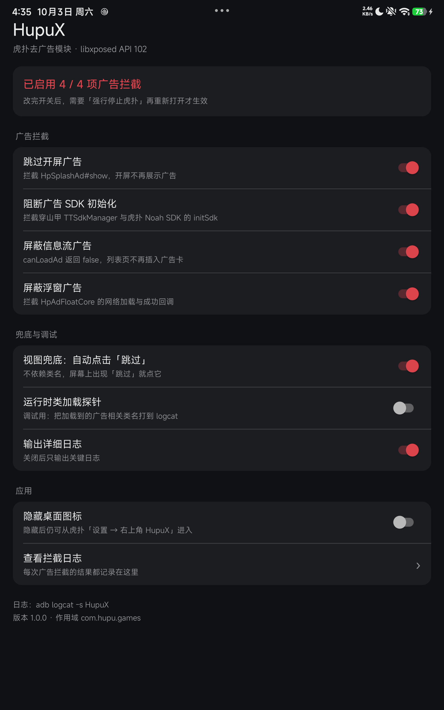
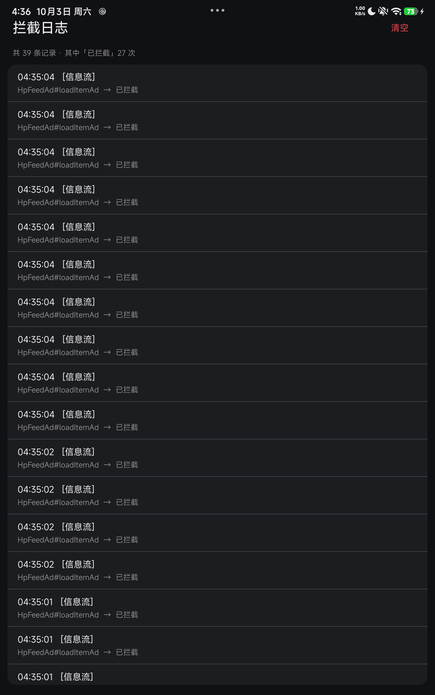

# HupuX

虎扑（`com.hupu.games`）去广告 Xposed 模块，基于 **libxposed 现代 Xposed API**
（`io.github.libxposed:api:102.0.0`）实现。

同时支持 **LSPosed**（需 root）与免 root 框架 **FPA / LSPatch / HKP**。



## 功能

| 开关 | 作用 | 对应 Hook |
|---|---|---|
| 跳过开屏广告 | 开屏不再展示广告 | `com.hupu.adver_boot.HpSplashAd#show`、`com.hupu.games.main.splash.SplashFragment#showSplashAd` / `#showSplashVideo` |
| 阻断广告 SDK 初始化 | 穿山甲 / 虎扑自研 Noah 聚合 SDK 不初始化 | `com.hupu.adver_base.sdk.TTSdkManager$Companion#initSdk`、`NoahSdkManager$Companion#initSdk`、`com.hupu.adver_boot.SplashAdStarter#init` |
| 屏蔽信息流广告 | 列表页不再插入广告卡 | `com.hupu.adver_feed.HpFeedAd#canLoadAd`（返回 false）、`#loadItemAd`、`com.hupu.adver_feed.core.HpFeedSdkAd#process` |
| 屏蔽浮窗广告 | 悬浮小窗广告不再出现 | `com.hupu.adver_float.HpAdFloatCore#loadFromNet` / `#loadSuccess` |
| 视图兜底 | 不依赖类名，屏幕上出现「跳过」就自动点击 | `android.app.Activity#onResume` |
| 运行时类加载探针 | 调试用：把加载到的广告相关类名打到 logcat | `java.lang.ClassLoader#loadClass` |

另外还有三项应用级功能：

- **拦截日志**：记录每次拦截的结果（已拦截 / 已放行），以及每个 Hook 是否安装成功
- **隐藏桌面图标**：隐藏的是桌面入口，应用本身仍可从虎扑设置页进入
- **首次使用协议**：首次进入虎扑时弹出「仅供学习使用」协议



## 环境要求

- Android 9 ~ 17
- **root**：LSPosed 2.2.0 或更高
- **免 root**：FPA 3.8（已实测）/ LSPatch 1.2 / HKP 2.0-266
    - ⚠️ 用 LSPatch 打补丁时**必须加 `--sigbypasslv 3`**。虎扑带网易易盾的签名校验，默认等级打出来的包会正常启动、显示主页，然后一两秒后静默退出。（已实测：这条与模块无关，不带模块的补丁包同样会退出）
- 作用域：虎扑 `com.hupu.games`（基于 8.2.63 编写并实测通过）

## 安装

### root（LSPosed）

1. 安装 APK；
2. LSPosed 管理器 → 模块 → 启用 **HupuX**；
3. 作用域勾选「虎扑」；
4. 强行停止虎扑后重新打开。

### 免 root（FPA / LSPatch / HKP）

在框架里选择虎扑 → 勾选 **HupuX** → 打补丁并安装。
注意免 root 方式需要先卸载原版虎扑（签名不同），**会丢失登录数据**。

### 免 root 实测记录

**FPA 3.8**（vivo V2425A / Android 16，无 root）

- 默认配置即可：Hook 核心 `LSPlant`、过签方案 `seccomp`。`seccomp` 能绕过易盾的签名校验，应用不会闪退。
- FPA **不把模块打进 APK**，而是在运行时从「已安装的模块 APK」加载。所以升级模块只要重装模块 APK，**不需要重新 patch 虎扑**。
- FPA 会按 `module.prop` 的 `targetApiVersion` 自动选择兼容层（本模块声明 102，日志里可见 `wrappers=[xp102]`）。
- `getRemotePreferences` 可用，模块里的开关能正常读到。

## 使用

模块的入口有两个：

- 桌面图标（可以被「隐藏桌面图标」开关藏起来）
- **虎扑 → 我的 → 设置 → 标题栏右上角「HupuX」**（隐藏图标后唯一的入口）

改动开关后需要**强行停止虎扑**再重新打开才生效。

日志有两个地方看：

- 模块界面里的「查看拦截日志」
- `adb logcat -s HupuX`

## 从源码构建

需要 JDK 17+ 与 Android SDK（`platforms;android-35`、`build-tools;35.0.0`）。

```bash
git clone https://github.com/xiaopi0329/HupuX.git
cd HupuX
echo "sdk.dir=/path/to/Android/Sdk" > local.properties
gradle assembleDebug
```

产物在 `app/build/outputs/apk/debug/app-debug.apk`。

> 签名密钥不入库。`assembleRelease` 在缺少 `app/hupux-release.jks` 时会跳过签名，
> 只产出一个未签名的包用于本地验证。要发布请把自己的 keystore 放到该路径，
> 或改 `app/build.gradle.kts` 里的 `signingConfigs`。

## 版本号规则

从 2026-10 起，版本号使用**构建时间**：`yyyyMMddHHmm`，12 位纯数字、无分隔符，
例如 `202610030450` 表示 2026-10-03 04:50 构建。

`versionCode` 用「距 1970 年的分钟数」（12 位时间戳超过 int 上限，塞不进 versionCode），
既单调递增、又与 versionName 一样精确到分钟。

## 目录结构

```
.
├── app/
│   ├── build.gradle.kts
│   ├── proguard-rules.pro
│   └── src/main/
│       ├── AndroidManifest.xml
│       ├── java/com/hupux/xpnb/
│       │   ├── HupuModule.java             # 模块入口（java_init.list 指向它）
│       │   ├── Config.java                 # 开关与日志
│       │   ├── AdHooks.java                # 精确 Hook 点（只登记规则）
│       │   ├── HookRegistry.java           # 规则表：类名 → 要 hook 的方法
│       │   ├── LazyHookInstaller.java      # 延迟安装器（加固应用必须）
│       │   ├── HookUtil.java               # 反射查方法 + 调 hook() 的公共逻辑
│       │   ├── SplashSkipHelper.java       # 视图树兜底跳过
│       │   ├── ClassProbe.java             # 运行时类加载探针
│       │   ├── AgreementGate.java          # 首次使用协议
│       │   ├── SettingsEntryInjector.java  # 把入口注入虎扑设置页标题栏
│       │   ├── AdsLog.java                 # 注入侧的拦截日志上报
│       │   ├── AdsLogStore.java            # 日志落盘
│       │   ├── LogProvider.java            # 接收跨进程日志的 ContentProvider
│       │   ├── LogActivity.java            # 拦截日志界面
│       │   └── MainActivity.java           # 模块设置界面
│       ├── res/                            # 布局、颜色（含深色模式）、图标
│       └── resources/META-INF/xposed/      # 模块身份三件套（关键）
│           ├── module.prop                 # minApiVersion / targetApiVersion
│           ├── java_init.list              # 入口类
│           └── scope.list                  # 默认作用域
└── settings.gradle.kts / build.gradle.kts / gradle.properties
```

## 三个实现要点

### 1. 加固应用的 Hook 时机

虎扑使用**网易易盾**加固，`classes.dex` 只是一个 30 个类的小壳，真实代码（21 段 dex、82282 个类）是运行期由壳解密后交给 ClassLoader 的。因此在 `onPackageReady` 里直接 `Class.forName` 必然 `ClassNotFoundException`。

`LazyHookInstaller` 的做法是**定时重试解析**：每秒一次、最多一分钟，用应用自己的 ClassLoader 去 `Class.forName`，谁先出现就给谁装 Hook。

> 早期版本还额外挂钩了 `ClassLoader#loadClass`，后来去掉了，原因有两条：
> **一是在 FPA(LSPlant) 上挂钩它会让虎扑卡死在启动阶段**（主线程停在 Hook 安装之后，进程活着但没有窗口）；
> 二是回看日志发现它**从未真正捕获过目标类**——Java 层的 `loadClass` 只覆盖显式调用，
> ART 在链接/校验阶段隐式解析类时不会走它，实际干活的一直是定时重试。

### 2. 跨进程的拦截日志

日志产生在虎扑进程里，日志界面在模块 App 进程里，两个进程 UID 不同、写不进对方的私有目录。所以中间加了一层 `LogProvider`：注入侧通过 `ContentResolver` 把记录插进来，落到模块 App 自己的文件里。

上报做了三件事避免拖慢虎扑：先进内存队列、延迟合并成一批、在独立线程写入；模块 App 不可用时直接丢弃并打警告，不反复重试。

> `LogProvider` 是 `exported` 的，任何应用都能往里写。里面只有广告拦截记录、不含隐私数据；要收紧可以加签名级权限或校验调用方包名。

### 3. 隐藏桌面图标

桌面入口挂在一个 `<activity-alias>` 上，开关直接调 `PackageManager.setComponentEnabledSetting()` 启用/禁用这个 alias。隐藏的是"桌面入口"而不是"应用"，`MainActivity` 保持 `exported`，所以虎扑设置页里那个入口照样能进来——这也是隐藏后唯一的返回路径。

## 已知限制

- Hook 点基于虎扑 **8.2.63** 的类名编写。虎扑升级后若类名变化，精确 Hook 会失效，但「视图兜底」和「SDK 初始化阻断」仍能起作用；可用「运行时类加载探针」定位新类名。
- `minApiVersion=101`，需要支持 libxposed 现代 API 的框架（LSPosed 2.x / FPA 3.x / LSPatch 1.x / HKP 2.x）。
- 清空虎扑应用数据会让「首次使用协议」重新弹出。

## 免责声明

本项目仅供**个人学习、研究**使用，用于学习 Android 逆向与 Xposed 模块开发。
请勿用于商业用途，请勿传播或分发由本项目产生的任何修改版应用。
使用本项目所产生的一切后果由使用者自行承担。
